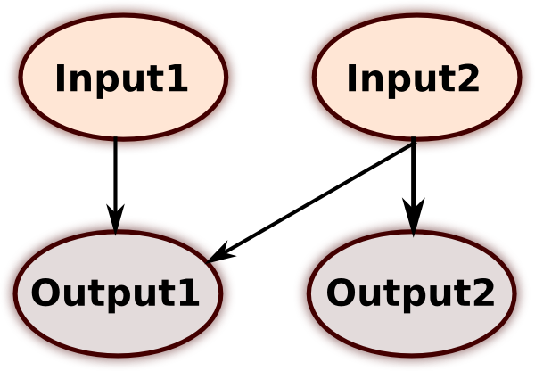
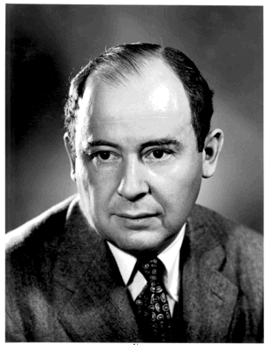

```{r setup, include=FALSE}
knitr::opts_chunk$set(echo = FALSE)
```

## Why make your analysis interactive? {.build}

- Communicate an analysis with collaborators.
- Teach statistical concepts.
- Public outreach.

## Examples from the web
- [Moving Habitat Model](https://movinghabitatmodel.shinyapps.io/BioticInteractions/)
- [Genetic Drift Simulation](http://rosetta.ahmedmoustafa.io/drift/)
- [ggplot2 Theme Builder](https://bchartoff.shinyapps.io/ggShinyApp/)
- [A lot more](http://www.showmeshiny.com/)

## Installing Shiny
Shiny is develping quickly. It is up on CRAN but the latest and greatest is on [GitHub](https://github.com).
```{r, eval=FALSE, echo=TRUE}
#install.packages(devtools)
library(devtools)
install_github("rstudio/shiny")
library(shiny)
```

## Structure of a Shiny App  {.build}
- server.R
```{r, eval=FALSE, echo=TRUE}
shinyServer(function(input, output) {
  ##Reacts to inputs and executes code 
  ##generating outputs when inputs change
  })
})
```

- ui.R
```{r, eval=FALSE, echo=TRUE}
shinyUI(
  ##Defines inputs, renders outputs.
)
```


## Why is it set up this way? {.build}

Reactive programming model:



## Lets build an app!

Our app will be called "Overfitting" and we will use it to explore one of the biggest downsides of using automated model selection.

## Overfitting {.build}
<div class="columns-2">

Fitting a large number of parameters to a small amount of data results in a model that fits great to the data you used to build the model, but poorly on independent data.

_"... with four parameters I can fit an elephant, and with five I can make him wiggle his trunk."_
--John von Neumann




</div>

## A simple script:

```{r, eval=TRUE, echo=TRUE, results='hide'}
##Input options
n_covar <- 4
n_obs <- 100

##Creates random response and predictors
response <- rnorm(n_obs,0,10)
covar_means <- rnorm(n_covar,40,20)
cov_list <- lapply(covar_means,FUN=function(x){rnorm(n_obs,x,5)})
covar <- matrix(unlist(cov_list),ncol=n_covar)
varnames <- paste("X",1:n_covar,sep="")
colnames(covar) <- varnames

##Binds everything into a data frame.
data <- data.frame(cbind(response,covar))
```
...

## Continued
...
```{r, eval=TRUE, echo=TRUE, results='hide'}
##Creates a formula for the saturated model.
cov_terms <- paste(varnames,"*",sep="",collapse="")
form_text <- paste("response~",cov_terms,sep="")
form <- formula(substr(form_text, 1, nchar(form_text)-1))

##Automated stepwise model selection.
lm1 <- lm(form,data=data)
lm2 <- step(lm1,scope=c("response~1",form),trace=0)

##Examines the output.
summary(lm2)
```

## This could be a function:

```{r, eval=TRUE, echo=TRUE}
overfit <- function(n_obs,n_covar,dir="both"){
  response <- rnorm(n_obs,0,10)
  covar_means <- rnorm(n_covar,40,20)
  cov_list <- lapply(covar_means,FUN=function(x){rnorm(n_obs,x,5)})
  covar <- matrix(unlist(cov_list),ncol=n_covar)
  varnames <- paste("X",1:n_covar,sep="")
  colnames(covar) <- varnames
  data <- data.frame(cbind(response,covar))
  cov_terms <- paste(varnames,"*",sep="",collapse="")
  form_text <- paste("response~",cov_terms,sep="")
  form <- formula(substr(form_text, 1, nchar(form_text)-1))
  lm1 <- lm(form,data=data)
  lm2 <- step(lm1,scope=c("response~1",form),trace=0,direction=dir)
  return(print(summary(lm2)))
}
```

## Filling out the structure:  {.build}

server.R
```{r, eval=FALSE, echo=TRUE}
library(shiny)
shinyServer(function(input, output) {
  ##Reacts to inputs and executes code
  ##generating outputs when inputs change.
  })
})
```
ui.R
```{r, eval=FALSE, echo=TRUE}
library(shiny)
shinyUI(
  ##Boxes / Sliders to change inputs.
  ##Displays a summary of the best model.
)
```

## Drop it into server.R

```{r, eval=FALSE, echo=TRUE}
library(shiny)
##Function we just created.
overfit <- function(n_obs,n_covar){
  ...
}
##Communicates with UI
shinyServer(function(input, output) {
  ##Expression "fit" reacts when inputs to function "overfit change"
  fit <- eventReactive(input$go, {
    overfit(input$n_obs,input$n_covar,input$sel_method)
  })
  ##Renders output
  output$print_fit <- renderPrint(fit())
})
```

## In ui.R:

```{r, eval=FALSE, echo=TRUE}
library(shiny)
shinyUI(pageWithSidebar(
  headerPanel("Overfitting"),
  sidebarPanel(
    numericInput("n_obs", "Number of Random Observations:", 
                min=1,max=500,value=50),
    selectInput("sel_method", "Model Selection Direction", 
                choices = c("backward", "both"),
                selected="both"),
    sliderInput("n_covar", "Number of Random Covariates:", 
                min=1,max=5,value=4),
    actionButton("go", "Go"),
  mainPanel(
    h4("Step-wise selected best model:"),
    verbatimTextOutput("print_fit"))
))
```

## Now we have an App!{.build}

launch an App locally from the R prompt by typing:
```{r, eval=FALSE, echo=TRUE}
library(shiny)
runApp("./overfit")
```

or deploy to [shinyapps.io](https://ibreckhe.shinyapps.io/overfit)
```{r eval=FALSE, echo=TRUE}
devtools::install_github('rstudio/shinyapps')
library(shinyapps)
shinyapps::setAccountInfo(name='ibreckhe',
			  token='10E5BAD432A35EDC8D521C71BC95FC0F',
			  secret='<SECRET>')
shinyapps::deployApp('./overfit')
```

## Let's use it to do an experiment

How do sample size and number of covariates influence the probability of detecting spurious relationships when using automated model selection?

Treatment | # Samples | # Covariates
----------|-----------|------------
    1     |    30     |    3     
    2     |    30     |    5     
    3     |    300    |    3     
    4     |    300    |    5   

Run 10 replicate simulations with your assigned treatment.
    
## You can also embed the application.
```{r tabsets, echo=FALSE}
shinyAppDir(
  appDir="./overfit",
  options = list(
    width = "100%", height = 400
  )
)
```